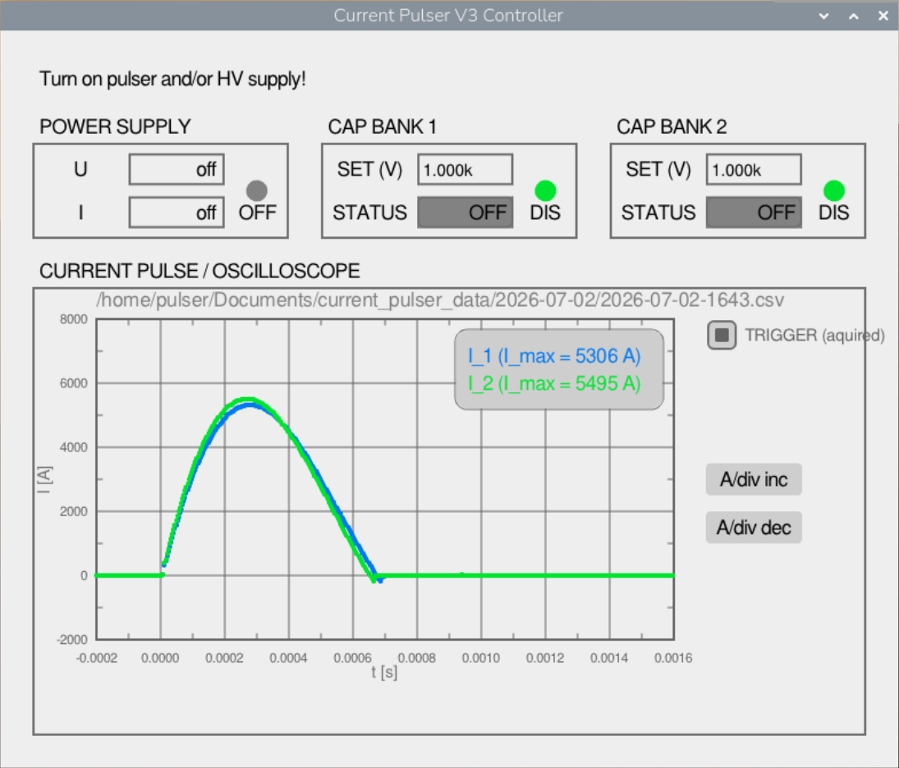

# Current Pulser V3 Controller



## Compile Rapberry Pi

Paste this into a terminal inside the raspberry pi and press enter:

```console
sudo apt update
sudo apt-get install -y gpiod libgpiod-dev libmodbus-dev libx11-dev libxcursor-dev libxinerama-dev libxrandr-dev libxi-dev libasound2-dev mesa-common-dev libgl1-mesa-dev
git clone --depth=1 --branch 5.5 https://github.com/raysan5/raylib/
cd raylib/src/
make PLATFORM=PLATFORM_DESKTOP GRAPHICS=GRAPHICS_API_OPENGL_21
sudo make DESTDIR=../../src/thirdparty/raylib-5.5-linux install
cd ../..
make
```

## Run

the executable is located at build/current_pulser.

```conosle
./build/current_pulser
```
